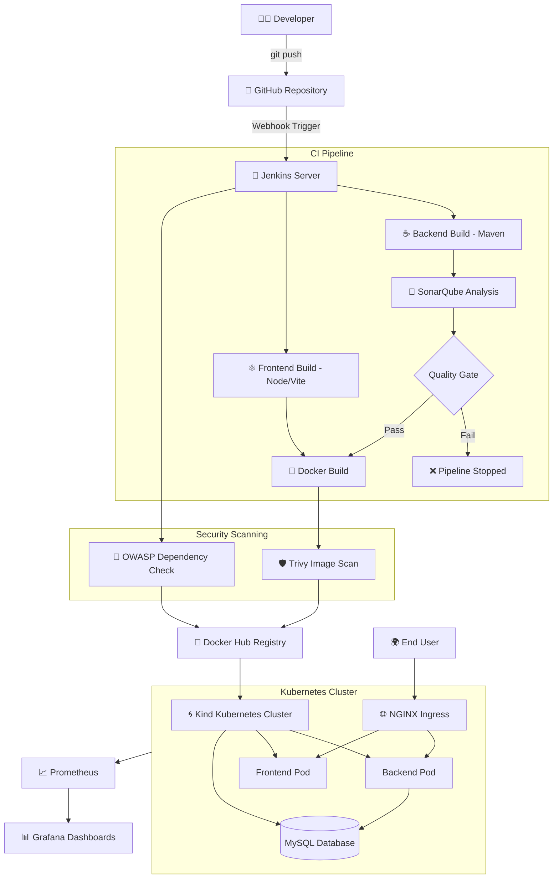
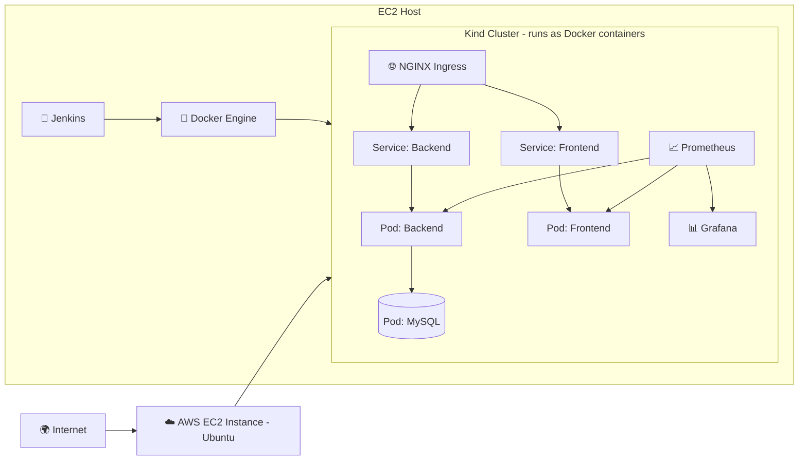
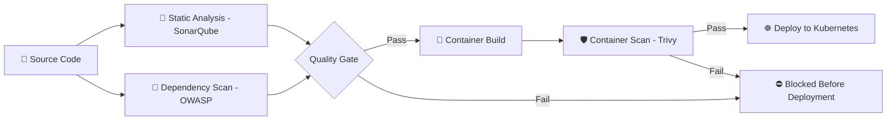

<div align="center">

# 🚀 DevSecOps CI/CD Platform — Full-Stack Application with Automated Security & Kubernetes Delivery

### *A production-style DevSecOps pipeline: from `git push` to a monitored, security-scanned deployment on Kubernetes*

<br/>

[](#)
[](#)
[](#)
[](#)
[](#)
[](#-license)

</div>

---

## 📚 Table of Contents

1. [Project Overview](#-1-project-overview)
2. [Features](#-2-features)
3. [Technology Stack](#-3-complete-technology-stack)
4. [High-Level Architecture](#-4-high-level-architecture)
5. [Infrastructure Architecture](#-5-infrastructure-architecture)
6. [CI/CD Pipeline](#-6-cicd-pipeline)
7. [DevSecOps Workflow](#-7-devsecops-workflow)
8. [Security Pipeline](#-8-security-pipeline)
9. [Repository Structure](#-9-repository-structure)
10. [Installation Guide](#-10-installation-guide)
11. [Clone Repository](#-11-clone-repository)
12. [Backend Setup](#-12-backend-setup)
13. [Frontend Setup](#-13-frontend-setup)
14. [Docker Setup](#-14-docker-setup)
15. [Jenkins Setup](#-15-jenkins-setup)
16. [Kubernetes Deployment](#-16-kubernetes-deployment)
17. [Monitoring](#-17-monitoring)
18. [Reports](#-18-reports)
19. [Screenshots](#-19-screenshots)
20. [Learning Outcomes](#-20-learning-outcomes)
21. [Future Improvements](#-21-future-improvements)
22. [Troubleshooting Guide](#-22-troubleshooting-guide)
23. [Author](#-23-author)
24. [License](#-24-license)

---

## 🧭 1. Project Overview

### What This Project Is

This repository is a **full-stack DevSecOps reference implementation** — a complete, self-hosted CI/CD platform that takes a **Java Spring Boot backend** and a **React frontend** from source code all the way to a **security-scanned, containerized deployment running on Kubernetes**, with live **observability via Prometheus and Grafana**.

It is not just an application — it is an **automation and security pipeline** built around that application, designed to mirror how real engineering teams ship software safely and repeatedly.

### Why It Was Built

Modern software delivery is not just "write code → deploy." Teams need:

- Automated builds triggered by every commit
- Code quality gates that block bad code before it merges
- Security scanning at every layer (source, dependencies, container images)
- Reproducible, declarative infrastructure and deployments
- Real-time visibility into running systems

This project was built to **implement all of the above by hand**, end-to-end, on a self-managed AWS EC2 instance — without relying on managed CI/CD SaaS platforms — in order to deeply understand *how* and *why* each piece of the DevOps/DevSecOps toolchain works.

### Problem Statement

Manually building, testing, scanning, and deploying an application is slow, error-prone, and insecure by default. There is no consistent gate that stops vulnerable dependencies, vulnerable container images, or low-quality code from reaching production.

### Objectives

- 🔁 Automate the full build → test → scan → package → deploy lifecycle
- 🔒 Shift security left by scanning code, dependencies, and images *before* deployment
- 📦 Containerize both frontend and backend for environment consistency
- ☸️ Deploy to a real (local) Kubernetes cluster using declarative manifests
- 📊 Provide live observability into cluster and application health
- 🎯 Trigger the entire pipeline automatically via GitHub Webhooks

### Business Use Case

This pipeline design mirrors what mid-size engineering organizations use to ship internal tools and customer-facing services safely — reducing manual QA overhead, catching vulnerabilities pre-release, and giving engineering leadership dashboard-level visibility into system health.

### Learning Goals

- Understand Jenkins pipeline-as-code (`Jenkinsfile`) design
- Understand the purpose and placement of security scanning tools in a pipeline
- Learn Kubernetes fundamentals using **Kind** (Kubernetes-in-Docker)
- Learn how Ingress controllers route external traffic to cluster services
- Learn how Prometheus/Grafana observe live infrastructure

### Who Can Use This Project

- 🎓 Students learning DevOps/DevSecOps end-to-end
- 💼 Engineers preparing for DevOps / Cloud / SRE interviews
- 🧑‍💻 Developers who want a reference CI/CD + security pipeline
- 🏗️ Anyone building a portfolio project that demonstrates real-world tooling

### Expected Audience

Recruiters, hiring managers, DevOps/Cloud/Security engineers, and technical interviewers evaluating hands-on, practical DevSecOps skill.

---

## ✨ 2. Features

| Category | Capability |
|---|---|
| 🔁 **CI/CD** | Fully automated Jenkins pipeline triggered on every `git push` |
| 🔗 **Webhook Automation** | GitHub Webhooks trigger Jenkins builds instantly — no polling |
| 🐳 **Containerization** | Multi-stage Docker builds for both backend and frontend |
| 📦 **Docker Hub Integration** | Automated image tagging and push to Docker Hub registry |
| 🧪 **Code Quality Analysis** | SonarQube static analysis with enforced Quality Gates |
| 🛡️ **Container Security Scanning** | Trivy scans Docker images for CVEs before deployment |
| 🔎 **Dependency Scanning** | OWASP Dependency-Check scans third-party libraries for known vulnerabilities |
| 📄 **Artifact Generation** | Build artifacts, JARs, and scan reports archived per build |
| ☸️ **Kubernetes Orchestration** | Declarative deployment to a local Kind cluster |
| 🌐 **Ingress Routing** | NGINX Ingress Controller exposes services via clean routing rules |
| 📊 **Monitoring Dashboards** | Prometheus metrics collection + Grafana visualization |
| 🚀 **Zero-Touch Deployment** | End-to-end automation from commit to running pods |
| 🧾 **Centralized Reporting** | All security/quality reports collected in one place per build |

---

## 🧰 3. Complete Technology Stack

| Layer | Technology | Purpose |
|---|---|---|
| **Backend Language** | ☕ Java | Core backend application language |
| **Backend Framework** | 🍃 Spring Boot | REST API & application framework |
| **Build Tool (Backend)** | 📦 Maven | Dependency management & build lifecycle |
| **Frontend Framework** | ⚛️ React | UI component framework |
| **Frontend Tooling** | ⚡ Vite | Fast frontend build/dev tooling |
| **Frontend Runtime** | 🟢 Node.js | JavaScript runtime for frontend build |
| **Containerization** | 🐳 Docker | Packaging backend & frontend into images |
| **Image Registry** | 🐋 Docker Hub | Storage & distribution of built images |
| **CI/CD Orchestrator** | 🧰 Jenkins | Pipeline automation engine |
| **Source Control** | 🐙 GitHub | Version control & source of truth |
| **Automation Trigger** | 🔗 GitHub Webhooks | Auto-triggers Jenkins on push events |
| **Code Quality** | 🧪 SonarQube | Static code analysis & quality gates |
| **Container Security** | 🛡️ Trivy | Vulnerability scanning of Docker images |
| **Dependency Security** | 🔎 OWASP Dependency-Check | CVE scanning of project dependencies |
| **Orchestration** | ☸️ Kubernetes | Container orchestration platform |
| **Local K8s Engine** | 🌀 Kind | Kubernetes-in-Docker for local clusters |
| **Ingress Controller** | 🌐 NGINX Ingress | Routes external traffic into the cluster |
| **Metrics Collection** | 📈 Prometheus | Time-series metrics scraping |
| **Visualization** | 📊 Grafana | Dashboards for metrics visualization |
| **Cloud Provider** | ☁️ AWS EC2 | Hosts the Jenkins/Docker/Kind environment |
| **OS** | 🐧 Ubuntu / Linux | Host operating system |
| **Version Control CLI** | 🔧 Git | Local source control operations |

---

## 🏗️ 4. High-Level Architecture



---

## 🖥️ 5. Infrastructure Architecture

The entire platform runs on a **single AWS EC2 instance** (Ubuntu/Linux), acting as both the CI/CD server and the local Kubernetes host.

| Component | Role |
|---|---|
| **AWS EC2** | Host virtual machine for the entire toolchain |
| **Jenkins Server** | Runs on the EC2 instance; orchestrates all pipeline stages |
| **Docker Engine** | Builds images and runs the Kind cluster's nodes as containers |
| **Kind Cluster** | A Kubernetes cluster running entirely inside Docker containers on the EC2 host |
| **Pods** | Backend, frontend, and database workloads running inside the cluster |
| **Services** | Stable internal networking endpoints for each deployment |
| **Ingress** | Single entry point routing external HTTP traffic to the correct service |
| **Monitoring Stack** | Prometheus + Grafana deployed inside (or alongside) the cluster, scraping metrics from pods and nodes |



> **Note:** Because Kind runs Kubernetes nodes as Docker containers, the entire cluster is disposable and reproducible — ideal for free-tier or resource-constrained environments where a managed cluster (EKS) isn't practical.

---

## ⚙️ 6. CI/CD Pipeline

The Jenkins pipeline is defined as code (`Jenkinsfile`) and executes the following stages in order:

<details>
<summary><strong>🔹 Stage 1 — Checkout</strong></summary>

| | |
|---|---|
| **Purpose** | Pull the latest source code from GitHub |
| **Input** | GitHub repository + branch reference |
| **Output** | Local workspace copy of source code |
| **Command** | `git checkout` (via Jenkins SCM step) |
| **Expected Result** | Clean, up-to-date workspace |
| **Artifacts** | Source checkout in Jenkins workspace |

</details>

<details>
<summary><strong>🔹 Stage 2 — Backend Build</strong></summary>

| | |
|---|---|
| **Purpose** | Compile and package the Spring Boot backend |
| **Input** | `backend/` source directory, `pom.xml` |
| **Output** | Executable `.jar` file |
| **Command** | `mvn clean package` |
| **Expected Result** | Successful build with no compilation errors |
| **Artifacts** | `target/*.jar` |

</details>

<details>
<summary><strong>🔹 Stage 3 — SonarQube Analysis</strong></summary>

| | |
|---|---|
| **Purpose** | Perform static code analysis for bugs, code smells, vulnerabilities |
| **Input** | Compiled backend source |
| **Output** | SonarQube project report |
| **Command** | `mvn sonar:sonar -Dsonar.projectKey=...` |
| **Expected Result** | Analysis submitted to SonarQube server |
| **Artifacts** | SonarQube dashboard report |

</details>

<details>
<summary><strong>🔹 Stage 4 — Quality Gate</strong></summary>

| | |
|---|---|
| **Purpose** | Enforce a minimum code quality threshold |
| **Input** | SonarQube analysis result |
| **Output** | Pass / Fail decision |
| **Command** | `waitForQualityGate()` (Jenkins SonarQube plugin) |
| **Expected Result** | Pipeline halts automatically if the gate fails |
| **Artifacts** | Quality Gate status report |

</details>

<details>
<summary><strong>🔹 Stage 5 — Frontend Build</strong></summary>

| | |
|---|---|
| **Purpose** | Install dependencies and build the React application |
| **Input** | `frontend/` source directory, `package.json` |
| **Output** | Static production build |
| **Command** | `npm install && npm run build` |
| **Expected Result** | `dist/` folder generated with production assets |
| **Artifacts** | `frontend/dist/` |

</details>

<details>
<summary><strong>🔹 Stage 6 — Docker Build</strong></summary>

| | |
|---|---|
| **Purpose** | Package backend and frontend into container images |
| **Input** | Backend JAR, frontend build output, Dockerfiles |
| **Output** | Two Docker images (backend, frontend) |
| **Command** | `docker build -t <user>/backend:<tag> .` |
| **Expected Result** | Images built successfully and tagged |
| **Artifacts** | Local Docker images |

</details>

<details>
<summary><strong>🔹 Stage 7 — Trivy Scan</strong></summary>

| | |
|---|---|
| **Purpose** | Scan built Docker images for known CVEs |
| **Input** | Locally built Docker images |
| **Output** | Vulnerability report (HTML/JSON) |
| **Command** | `trivy image <image>:<tag>` |
| **Expected Result** | No critical/high vulnerabilities (or acknowledged exceptions) |
| **Artifacts** | `trivy-report.html` / `.json` |

</details>

<details>
<summary><strong>🔹 Stage 8 — OWASP Dependency Check</strong></summary>

| | |
|---|---|
| **Purpose** | Scan third-party dependencies for known CVEs |
| **Input** | `pom.xml` / `package.json` dependency trees |
| **Output** | Dependency vulnerability report |
| **Command** | `dependency-check.sh --project "app" --scan .` |
| **Expected Result** | Report generated highlighting any vulnerable libraries |
| **Artifacts** | `dependency-check-report.html` |

</details>

<details>
<summary><strong>🔹 Stage 9 — Archive Reports</strong></summary>

| | |
|---|---|
| **Purpose** | Preserve all quality/security reports per build |
| **Input** | Trivy, OWASP, SonarQube reports |
| **Output** | Archived build artifacts in Jenkins |
| **Command** | `archiveArtifacts` (Jenkins pipeline step) |
| **Expected Result** | Reports downloadable from the Jenkins build page |
| **Artifacts** | All `*-report.html` / `.json` files |

</details>

<details>
<summary><strong>🔹 Stage 10 — Docker Push</strong></summary>

| | |
|---|---|
| **Purpose** | Push validated images to Docker Hub |
| **Input** | Scanned, tagged Docker images |
| **Output** | Images available in Docker Hub registry |
| **Command** | `docker push <user>/<image>:<tag>` |
| **Expected Result** | Image visible in Docker Hub repository |
| **Artifacts** | Remote image reference (registry URL + tag) |

</details>

<details>
<summary><strong>🔹 Stage 11 — Deployment</strong></summary>

| | |
|---|---|
| **Purpose** | Deploy updated images to the Kind Kubernetes cluster |
| **Input** | Kubernetes manifests (`k8s/*.yaml`), new image tags |
| **Output** | Updated running pods |
| **Command** | `kubectl apply -f k8s/` |
| **Expected Result** | Rolling update completes with no downtime |
| **Artifacts** | Updated Deployment/ReplicaSet objects |

</details>

<details>
<summary><strong>🔹 Stage 12 — Verification</strong></summary>

| | |
|---|---|
| **Purpose** | Confirm the deployment is healthy |
| **Input** | Cluster state |
| **Output** | Pod/service health status |
| **Command** | `kubectl get pods`, `kubectl rollout status` |
| **Expected Result** | All pods in `Running` state, readiness probes passing |
| **Artifacts** | Verification log output |

</details>

<details>
<summary><strong>🔹 Stage 13 — Workspace Cleanup</strong></summary>

| | |
|---|---|
| **Purpose** | Free disk space and remove temporary build artifacts |
| **Input** | Jenkins workspace, dangling Docker images |
| **Output** | Cleaned workspace |
| **Command** | `cleanWs()`, `docker system prune -f` |
| **Expected Result** | Reduced disk usage, no stale containers/images |
| **Artifacts** | None (cleanup stage) |

</details>

> ⚠️ **Warning:** On free-tier EC2 instances (1 vCPU / 1GB RAM), running SonarQube + Trivy + OWASP Dependency-Check + Docker + Kind simultaneously can exhaust memory. See the [Troubleshooting Guide](#-22-troubleshooting-guide) for swap-space and resource-tuning tips.

---

## 🔐 7. DevSecOps Workflow

This pipeline intentionally uses **three different, complementary security tools** — each covering a different attack surface:

| Tool | Layer Scanned | What It Catches |
|---|---|---|
| **SonarQube** | Source code | Bugs, code smells, security hotspots, maintainability issues |
| **OWASP Dependency-Check** | Third-party dependencies | Known CVEs in libraries pulled via Maven/npm |
| **Trivy** | Container images | OS package & application-layer vulnerabilities baked into the image |

### Why All Three Together

No single tool covers the full software supply chain:

- **SonarQube** only looks at *code you wrote* — it has no visibility into third-party libraries or the final container.
- **OWASP Dependency-Check** only looks at *declared dependencies* — it doesn't see your own code's bugs or what ends up in the container's OS layer.
- **Trivy** only looks at *the built artifact* — it can't tell you *why* a vulnerability exists in your code logic.

Using all three closes the gap across the entire path from source → dependency → container.

### Security Shift-Left

By running these scans **inside the CI pipeline** — before any image is pushed to Docker Hub or deployed — vulnerabilities are caught **early**, when they are cheapest and safest to fix, rather than being discovered after the application is already live in production.



---

## 🛡️ 8. Security Pipeline

| Control | Description |
|---|---|
| **Code Quality** | Enforced via SonarQube static analysis on every build |
| **Quality Gates** | Automated pass/fail thresholds prevent low-quality code from progressing |
| **Docker Image Scanning** | Trivy scans every image for OS and application CVEs before push |
| **Dependency Analysis** | OWASP Dependency-Check flags vulnerable third-party libraries |
| **Artifact Reports** | Every scan produces a persisted, auditable report per build |
| **Risk Reduction** | Vulnerabilities are caught pre-deployment, reducing production exposure |

> 💡 **Tip:** Treat a failed Quality Gate or a Critical/High Trivy finding as a hard stop — don't push to Docker Hub until it's resolved or explicitly risk-accepted.

---

## 📁 9. Repository Structure

```
.
├── backend/            # Spring Boot application (Java, Maven)
│   ├── src/
│   └── pom.xml
├── frontend/            # React + Vite application
│   ├── src/
│   └── package.json
├── k8s/                 # Kubernetes manifests (Deployments, Services, Ingress)
│   ├── backend-deployment.yaml
│   ├── frontend-deployment.yaml
│   ├── mysql-deployment.yaml
│   └── ingress.yaml
├── kind/                # Kind cluster configuration
│   └── kind-config.yaml
├── monitoring/          # Prometheus & Grafana configuration
│   ├── prometheus.yaml
│   └── grafana-dashboards/
├── reports/             # Generated security & quality reports
│   ├── trivy/
│   ├── dependency-check/
│   └── sonarqube/
├── docs/                # Architecture docs, diagrams, notes
├── scripts/             # Helper/automation shell scripts
├── Jenkinsfile          # Pipeline-as-code definition
└── README.md
```

| Folder | Purpose |
|---|---|
| `backend/` | Java Spring Boot REST API source code |
| `frontend/` | React + Vite single-page application source code |
| `k8s/` | All Kubernetes YAML manifests for deployment |
| `kind/` | Local cluster topology configuration |
| `monitoring/` | Prometheus scrape configs and Grafana dashboard JSON |
| `reports/` | Auto-generated security/quality scan output per build |
| `docs/` | Supporting architecture diagrams and design notes |
| `scripts/` | Utility scripts (setup, cleanup, helpers) |

---

## 🛠️ 10. Installation Guide

### Prerequisites

Install the following on your machine (Ubuntu/Linux recommended):

| Tool | Minimum Version | Check Command |
|---|---|---|
| Java (JDK) | 17+ | `java -version` |
| Node.js | 18+ | `node -v` |
| Docker | 24+ | `docker -v` |
| kubectl | 1.28+ | `kubectl version --client` |
| Kind | 0.20+ | `kind version` |
| Jenkins | LTS | via web UI |
| Git | 2.x | `git --version` |

> 📝 **Note:** If you're on a free-tier cloud VM (e.g., AWS EC2 `t2.micro`), enable swap space before installing Jenkins + Docker + Kind together — these tools are memory-hungry.

---

## 📥 11. Clone Repository

```bash
git clone https://github.com/yourusername/your-repo.git
cd your-repo
```

---

## ☕ 12. Backend Setup

```bash
cd backend

# Build the application
mvn clean package

# Run locally
java -jar target/*.jar
```

Backend runs by default on: `http://localhost:8080`

---

## ⚛️ 13. Frontend Setup

```bash
cd frontend

# Install dependencies
npm install

# Run development server
npm run dev

# Build for production
npm run build
```

Frontend dev server runs by default on: `http://localhost:5173`

---

## 🐳 14. Docker Setup

```bash
# Build backend image
docker build -t yourusername/backend:latest ./backend

# Build frontend image
docker build -t yourusername/frontend:latest ./frontend

# Run containers locally (quick test)
docker run -p 8080:8080 yourusername/backend:latest
docker run -p 3000:80 yourusername/frontend:latest
```

---

## 🧰 15. Jenkins Setup

### Required Plugins

- Pipeline
- Git
- Docker Pipeline
- SonarQube Scanner
- OWASP Dependency-Check
- Kubernetes CLI

### Required Tools (configured in Jenkins → Global Tool Configuration)

- JDK 17
- Maven
- NodeJS
- Docker
- SonarQube Scanner

### Credentials to Configure

| Credential ID | Type | Used For |
|---|---|---|
| `dockerhub-creds` | Username/Password | Pushing images to Docker Hub |
| `github-creds` | Username/Token | Pulling private repo (if applicable) |
| `sonar-token` | Secret Text | Authenticating with SonarQube server |

### GitHub Webhook Configuration

1. Go to your GitHub repo → **Settings → Webhooks → Add Webhook**
2. Payload URL: `http://<your-jenkins-url>/github-webhook/`
3. Content type: `application/json`
4. Trigger on: **Just the push event**
5. In Jenkins job config, enable **"GitHub hook trigger for GITScm polling"**

### SonarQube Integration

1. Jenkins → **Manage Jenkins → System → SonarQube Servers**
2. Add server URL + authentication token
3. Reference it in the `Jenkinsfile` via `withSonarQubeEnv('SonarQube')`

---

## ☸️ 16. Kubernetes Deployment

```bash
# Create the Kind cluster
kind create cluster --config kind/kind-config.yaml

# Apply all manifests
kubectl apply -f k8s/

# Verify deployments
kubectl get deployments
kubectl get pods
kubectl get svc
kubectl get ingress
```

| Resource | Purpose |
|---|---|
| **Deployments** | Manage desired replica state for backend/frontend pods |
| **Services** | Provide stable internal DNS/networking to pods |
| **Ingress** | Routes external traffic (e.g., `/api` → backend, `/` → frontend) |

### Verification

```bash
kubectl get pods -o wide
kubectl describe ingress app-ingress
kubectl logs deployment/backend
```

---

## 📊 17. Monitoring

| Component | Role |
|---|---|
| **Prometheus** | Scrapes metrics from pods, nodes, and the cluster itself |
| **Grafana** | Visualizes Prometheus data through pre-built dashboards |
| **Metrics** | CPU/memory usage, pod restarts, request latency, HTTP status codes |
| **Dashboards** | Cluster health, application performance, request throughput |

```bash
# Apply monitoring stack
kubectl apply -f monitoring/

# Port-forward Grafana locally
kubectl port-forward svc/grafana 3000:3000
```

Access Grafana at: `http://localhost:3000`

---

## 📄 18. Reports

| Report Type | Generated By | Location |
|---|---|---|
| **Trivy Report** | Container image scan | `reports/trivy/` |
| **OWASP Report** | Dependency vulnerability scan | `reports/dependency-check/` |
| **SonarQube Report** | Static code analysis | Available on SonarQube dashboard + `reports/sonarqube/` |
| **Build Artifacts** | Jenkins `archiveArtifacts` step | Jenkins job → **Build → Artifacts** |

---

## 🖼️ 19. Screenshots

<details>
<summary>Click to expand screenshot placeholders</summary>

| Screenshot | Placeholder |
|---|---|
| High-Level Architecture | `` |
| Jenkins Pipeline View | `` |
| Jenkins Dashboard | `` |
| SonarQube Report | `` |
| Trivy Scan Report | `` |
| OWASP Dependency Report | `` |
| Docker Hub Repository | `` |
| Kubernetes Pods | `` |
| Ingress Routing | `` |
| Grafana Dashboard | `` |
| Prometheus Targets | `` |
| Application UI | `` |

</details>

---

## 🎓 20. Learning Outcomes

Building this project demonstrates hands-on, practical proficiency in:

| Domain | Skills Demonstrated |
|---|---|
| **DevOps** | CI/CD pipeline design, pipeline-as-code, build automation |
| **Cloud** | AWS EC2 provisioning and server administration |
| **Security** | SAST, dependency scanning, container image scanning, shift-left security |
| **CI/CD** | Jenkins multi-stage pipeline authorship and debugging |
| **Containers** | Docker image design, multi-stage builds, registry management |
| **Kubernetes** | Deployments, Services, Ingress, cluster troubleshooting |
| **Linux** | Server administration, resource management, shell scripting |
| **Automation** | Webhook-driven triggers, zero-touch deployments |
| **Monitoring** | Metrics collection and dashboarding with Prometheus/Grafana |
| **Infrastructure** | Designing and reasoning about a full system architecture |

---

## 🔮 21. Future Improvements

| Improvement | Benefit |
|---|---|
| **Terraform** | Codify AWS infrastructure provisioning (IaC) |
| **Helm** | Package Kubernetes manifests into reusable charts |
| **ArgoCD** | Move from Jenkins push-deploy to GitOps pull-based deployment |
| **AWS EKS** | Move from local Kind cluster to a managed, production-grade cluster |
| **HashiCorp Vault** | Centralized secrets management instead of Jenkins credentials store |
| **Falco** | Runtime security monitoring for the Kubernetes cluster |
| **Slack Notifications** | Real-time pipeline status alerts to a team channel |
| **Email Notifications** | Build failure/success alerts via email |
| **Horizontal Pod Autoscaler** | Automatic scaling based on CPU/memory load |
| **GitOps Workflow** | Git as the single source of truth for cluster state |

---

## 🧯 22. Troubleshooting Guide

<details>
<summary><strong>Docker Issues</strong></summary>

- **"Cannot connect to Docker daemon"** → Ensure the Docker service is running: `sudo systemctl start docker`
- **Permission denied on docker.sock** → Add your user to the docker group: `sudo usermod -aG docker $USER` then re-login
- **Disk full during build** → Run `docker system prune -a` to remove unused images/containers

</details>

<details>
<summary><strong>Jenkins Issues</strong></summary>

- **Jenkins unresponsive / OOM on small EC2 instances** → Add swap space, or reduce Jenkins JVM heap via `JAVA_OPTS`
- **Pipeline fails at plugin step** → Confirm the required plugin is installed under **Manage Jenkins → Plugins**
- **Webhook not triggering builds** → Verify the payload URL is publicly reachable and the security group allows inbound traffic on Jenkins' port

</details>

<details>
<summary><strong>Kind / Kubernetes Issues</strong></summary>

- **`kind create cluster` hangs** → Ensure Docker has enough allocated memory (Kind needs ~2GB+ minimum)
- **Pods stuck in `Pending`** → Check node resource limits with `kubectl describe node`
- **Pods in `CrashLoopBackOff`** → Inspect logs: `kubectl logs <pod-name> --previous`

</details>

<details>
<summary><strong>SonarQube Issues</strong></summary>

- **SonarQube fails to start** → It requires `vm.max_map_count >= 262144`; set via `sysctl -w vm.max_map_count=262144`
- **Quality Gate step times out** → Confirm the Jenkins webhook back to SonarQube is correctly configured

</details>

<details>
<summary><strong>Trivy Issues</strong></summary>

- **Trivy DB download fails** → Check network/proxy access to `ghcr.io` where the vulnerability DB is hosted
- **Scan takes too long on first run** → This is expected — Trivy downloads and caches its vulnerability database on first execution

</details>

<details>
<summary><strong>OWASP Dependency-Check Issues</strong></summary>

- **NVD data feed download fails/times out** → Common on free-tier instances with limited bandwidth; consider using a local NVD mirror or API key
- **Scan takes excessively long** → Normal on first run while it builds the local vulnerability database cache

</details>

<details>
<summary><strong>Webhook Issues</strong></summary>

- **GitHub shows red X on webhook delivery** → Check the "Recent Deliveries" tab in GitHub for the exact error response from Jenkins
- **Webhook works but pipeline doesn't start** → Confirm the Jenkins job has "GitHub hook trigger for GITScm polling" enabled

</details>

---

## 👤 23. Author

**Your Name**
DevOps / Cloud Engineer

- 🔗 GitHub: [@Fardinn-Khan](https://github.com/Fardinn-Khan)
- 💼 LinkedIn: [Fardin-Khan](https://linkedin.com/in/Fardin-Khan-Open-to-work)
- 📧 Email: fardinnwork@gmail.com

> Built as a hands-on deep dive into DevSecOps practices — from CI/CD pipelines to Kubernetes deployment and live monitoring.

---

## 📜 24. License

This project is licensed under the **MIT License** — see the [LICENSE](LICENSE) file for details.

```
MIT License

Copyright (c) 2026 Your Name

Permission is hereby granted, free of charge, to any person obtaining a copy
of this software and associated documentation files (the "Software"), to deal
in the Software without restriction, including without limitation the rights
to use, copy, modify, merge, publish, distribute, sublicense, and/or sell
copies of the Software, subject to the following conditions:

The above copyright notice and this permission notice shall be included in
all copies or substantial portions of the Software.
```

---

<div align="center">

### ⭐ If this project helped you understand DevSecOps, consider giving it a star!

</div>
